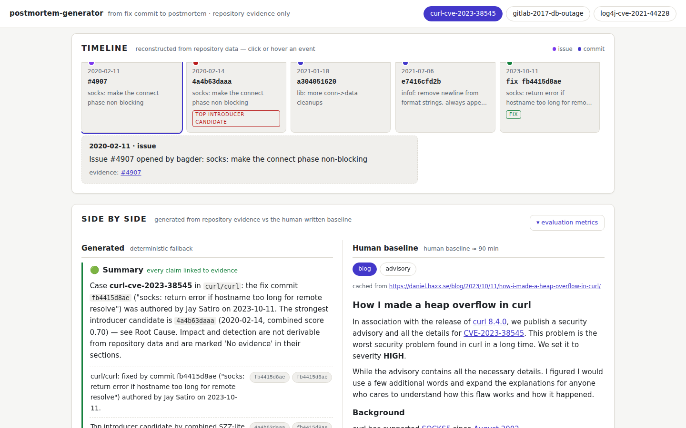
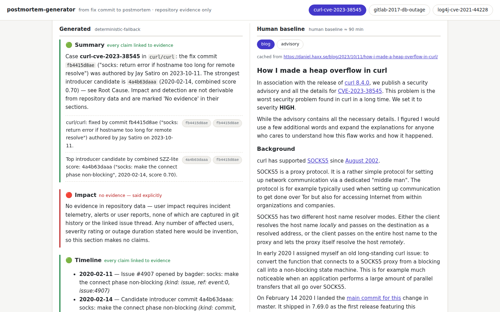
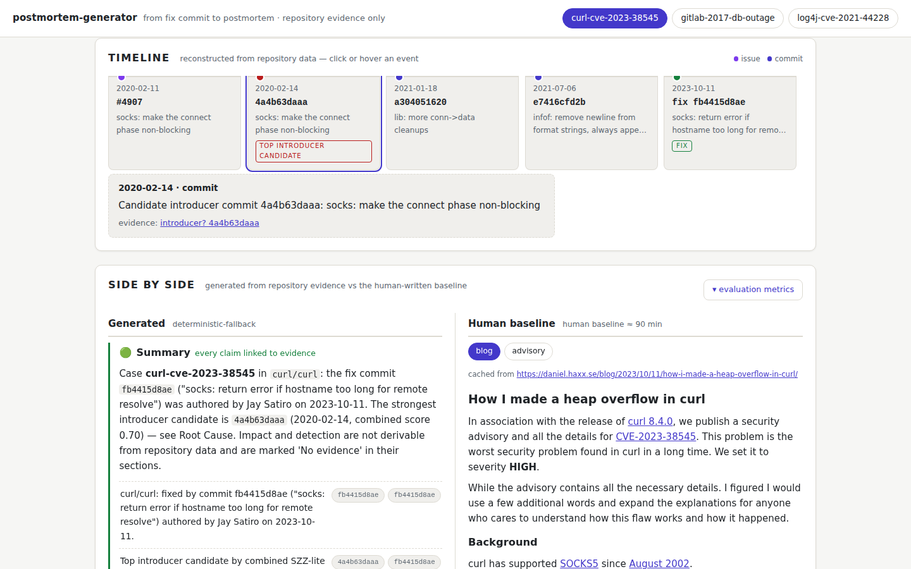
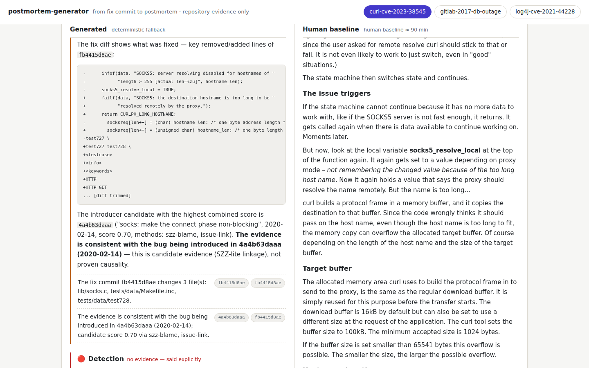
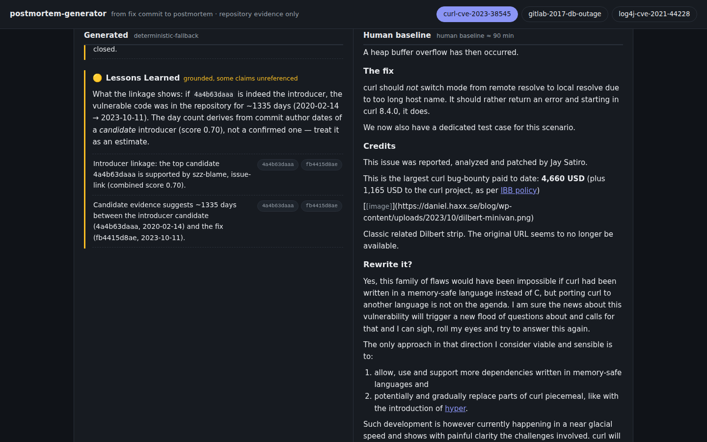
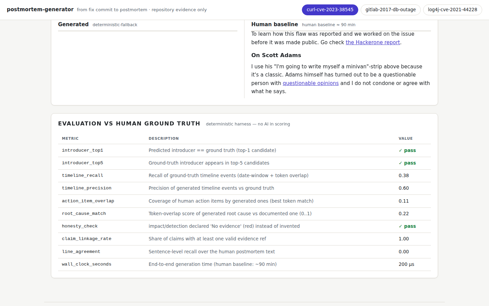
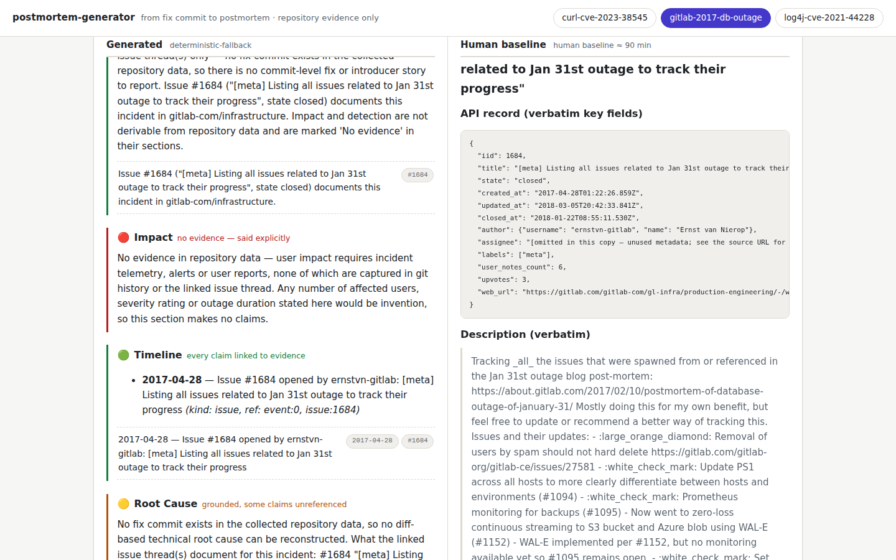
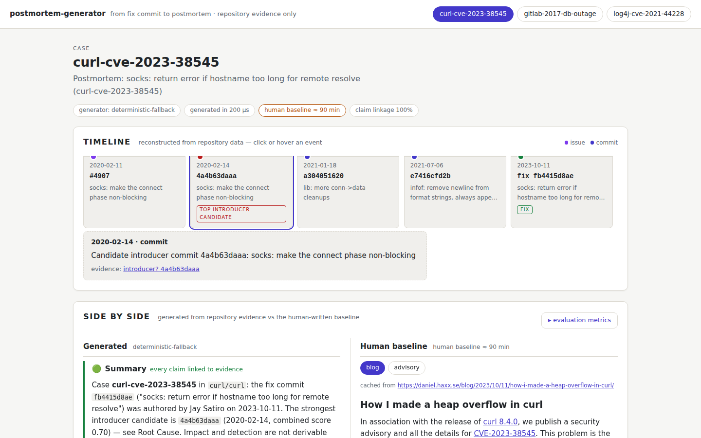

# Video dry run — backup take driving the real UI (offline)

Backup take of the demo video ([script](video-script.md), total **4:20**) using **only
`ui/index.html`** as on-screen material. Every beat below was actually executed against the
committed UI in a headless browser and captured to `docs/assets/video-dryrun/` — this is a
rehearsal log, not a plan: each screenshot's key element was asserted visible before capture,
and every figure cited was cross-checked against `eval-output/curl-cve-2023-38545/eval_report.json`.

## How this was produced (100% offline)

- **No playwright / no chrome in PATH / loopback TCP blocked** in the recording-prep
  environment (even `127.0.0.1` HTTP to a local server times out), so browser driving via
  networked CDP was impossible.
- Used the Chromium already on disk at `~/.cache/ms-playwright/chromium-1234/chrome-linux64/chrome`
  driven through `--remote-debugging-pipe` (DevTools Protocol over fds 3/4, NUL-delimited
  JSON) with a pure-`python3.12` stdlib driver. No packages installed, nothing fetched.
- Viewport **1440×900**, default light theme (the UI's default); `beat4c` uses dark theme via
  emulated `prefers-color-scheme: dark` to prove the UI's dark mode works for the money moment.
- All 9 PNGs are 1440×900, 145–296 KB each (none blank). `🟢🟡🔴` render via Noto Color Emoji.
- To reproduce a still on any machine with chromium:
  `chromium --headless --disable-gpu --no-sandbox --screenshot=beat1.png --window-size=1440,900 'file://<repo>/ui/index.html'`
  — interactions (clicks/toggles) need a real browser or a CDP driver; the exact steps are below.

## Timing skeleton (identical to the script — sums to 4:20 = 260 s)

| # | Beat | Window | Budget | Screenshot |
|---|------|--------|--------|------------|
| 1 | Hook — the unwritten postmortem | 0:00–0:25 | 25 s | [beat1](assets/video-dryrun/beat1.png) |
| 2 | Positioning — repo-first | 0:25–0:55 | 30 s | [beat2](assets/video-dryrun/beat2.png) |
| 3 | Architecture — the 4 pieces | 0:55–1:40 | 45 s | [beat3](assets/video-dryrun/beat3.png) |
| 4 | Demo — curl CVE-2023-38545 | 1:40–3:10 | 90 s | [beat4](assets/video-dryrun/beat4.png) · [4b](assets/video-dryrun/beat4b-side-by-side.png) · [4c](assets/video-dryrun/beat4c-money.png) |
| 5 | Metrics vs human | 3:10–3:40 | 30 s | [beat5](assets/video-dryrun/beat5.png) |
| 6 | Honest limits | 3:40–4:05 | 25 s | [beat6](assets/video-dryrun/beat6.png) |
| 7 | Close + CTA | 4:05–4:20 | 15 s | [beat7](assets/video-dryrun/beat7.png) |

The UI covers the script's browser sub-beats (2:20 / 2:40 / 2:50) and replaces the
editor/metrics-frame beats with equivalent UI framing. Terminal command (1:40), Bob session
flash #1/#2 and overlay cards are edit-time inserts — see each beat's "not in the UI" note.

---

## BEAT 1 · Hook · 0:00–0:25 (25 s)

- **On screen:** top of `ui/index.html` — brand line `postmortem-generator · from fix commit to
  postmortem · repository evidence only`, the three case tabs (`curl-cve-2023-38545` ·
  `gitlab-2017-db-outage` · `log4j-cve-2021-44228`), and the curl case header pills:
  `generator: deterministic-fallback` · `generated in 200 µs` · **`human baseline ≈ 90 min`** ·
  `claim linkage 100%`.
- **Interaction:** none. Open the file, land on the curl case (default), leave the pointer still.
  The 90-minute-vs-200-µs pill pair is the hook; the script's overlay "≈ 90 minutes of human
  writing — per report" can still be cut over it.
- **Narration cue:** "An incident ends… the postmortem never gets written — about ninety minutes
  of human writing, per report. Our question: after the merge, what does the repository already know?"
- **Verified before capture:** `human baseline ≈ 90 min` pill and `200 µs` pill present in the
  curl case header (`eval_report.wall_clock_seconds = 0.0002 s`).
- *Not in the UI:* the empty `postmortem.md` editor frame from the script — keep it as a
  separate terminal/editor scene, or drop it in the one-take mode.

## BEAT 2 · Positioning · 0:25–0:55 (30 s)

- **On screen:** the **Timeline** panel: `reconstructed from repository data — click or hover an
  event`, legend (issue/commit), and the five-event track: `2020-02-11 #4907` (issue) →
  **`2020-02-14 4a4b63daaa` tagged "top introducer candidate"** (red) → `a304051620` →
  `e7416cfd2b` → **`2023-10-11 fix fb4415d8ae`** (green). The 3.5-year gap reads at a glance.
- **Interaction:** one smooth scroll from the header down to the Timeline section
  (`.timeline-panel`, roughly 190 px at 1440×900). Hover along the track so cards highlight —
  the detail panel under the track updates on hover/click.
- **Narration cue:** "It starts from the repository, connecting the issue to the commit that
  introduced the bug — not from the managed incident stack."
- **Verified:** exactly 6 milestone timeline events in the curl track (issue open, introducer
  authored, introducer pushed + PR closed — one merged line, release 7.69.0, release 8.4.0,
  fix); `is-top` (introducer) and `is-fix`
  cards present.
- *Not in the UI:* the split-screen "managed incident stack vs repository" — edit-time overlay
  (script beat 2). The track itself carries the argument here.

## BEAT 3 · Architecture · 0:55–1:40 (45 s)

- **On screen:** the **Side by side** section header: left column `Generated (deterministic-fallback)`
  with the section list and badges — 🟢 Summary · 🔴 Impact · 🟢 Timeline · 🟡 Root Cause ·
  🔴 Detection · 🟢 Resolution and Recovery · 🟡 Action Items · 🟡 Lessons Learned — plus the
  badge legend (every claim linked / grounded, some unreferenced / no evidence — said explicitly)
  and the first evidence chips under Summary. Right column: `Human baseline (human baseline ≈ 90 min)`,
  blog tab.
- **Interaction:** scroll from the timeline to the `Side by side` h2 (~630 px at 1440×900);
  hover the badge notes so they're clearly the label system being described. At ~1:30 slow-scroll
  the left column over 🟢→🔴 headers for the badge close-up.
- **Narration cue:** "Four pieces: a deterministic collector running SZZ; IBM Bob in Agent mode
  orchestrating role subagents; a template where every claim carries a link and every section a
  badge; an evaluation harness. The prompt is the last 10% — the product is the pipeline."
- **Verified:** 8 badge-bearing sections in the generated column, red badges present.
- *Not in the UI:* the 4-block architecture diagram (README asset) and the Bob subagents panel
  flash #1 (~1:12, required evidence) — both are edit-time inserts from `bob_sessions/`.

## BEAT 4 · Demo · 1:40–3:10 (90 s)

Three UI sub-beats (the terminal command at 1:40, the postmortem.md scroll at 2:00 and the
Bob session flash #2 at 1:55 stay terminal/editor scenes).

### 4 · 2:20 — click the introducer event

- **On screen:** the timeline with the **`2020-02-14` introducer card selected** and the detail
  panel below: `2020-02-14 · commit` — "Candidate introducer commit 4a4b63daaa: socks: make the
  connect phase non-blocking" — `evidence: introducer? 4a4b63daaa` as a real GitHub commit link
  (`/curl/curl/commit/4a4b63daaa01…`).
- **Interaction:** click the red **top introducer candidate** card (`.tl-item.is-top`, second
  card). The detail panel swaps instantly. Optionally then click the green `2023-10-11` fix card
  — the introduced→fixed arc in two clicks.
- **Narration cue:** "Click the introducer event: February 14th, 2020 — commit 4a4b63daaa, a
  non-blocking SOCKS refactor."

### 4b · 2:40 — generated vs human, side by side

- **On screen:** left — 🟡 **Root Cause** with the claim "Top introducer candidate by combined
  SZZ-lite score: 4a4b63daaa (socks: make the connect phase non-blocking, 2020-02-14,
  **score 0.70**)" and its evidence chips (`4a4b63daaa`, `fb4415d8ae`, each linking to GitHub);
  right — Stenberg's blog post; the paragraph containing "On **February 14 2020** I landed the
  **main commit for this**…" aligns with it.
- **Interaction:** scroll the left column to Root Cause (h3, ~2,100 px). To put the literal SHA on
  both sides: **Ctrl+F `4a4b63daaa`** — the browser highlights the left chips and the right link
  simultaneously — or click the **advisory** tab on the right column, which renders
  "Introduced-in: `https://github.com/curl/curl/commit/4a4b63daaa`" as link text.
  (In the blog tab the SHA is the link's target, not its text — see Findings.)
- **Narration cue:** "Side by side: our generated postmortem, and the one Daniel Stenberg wrote
  by hand. Same introducer."

### 4c · 2:50 — the money moment (dark)

- **On screen:** the generated 🟢 Timeline section scrolled to the claim: **"Candidate evidence
  suggests ~1335 days between the introducer candidate (4a4b63daaa, 2020-02-14) and the fix
  (fb4415d8ae, 2023-10-11)"** with its chips — shown in the UI's dark theme.
- **Interaction:** scroll the left column to that claim, toggle the browser/OS to dark (the UI
  follows `prefers-color-scheme` automatically). The 0→1,335 counter and the
  "2020-02-14 → 2023-10-11" dates stay an edit-time full-screen overlay per the script; this
  frame is what's under it and the receipt for the number.
- **Narration cue:** "The fix landed October 11th, 2023. The bug was born February 14th, 2020.
  That is 1,335 days before the fix."
- **Verified:** the claim text exists and is in-viewport; the date pair in it matches the script.

## BEAT 5 · Metrics · 3:10–3:40 (30 s)

- **On screen:** the **`▾ evaluation metrics`** toggle clicked, revealing the "Evaluation vs human
  ground truth — deterministic harness, no AI in scoring" table with rows lighting up in order:
  `introducer_top1 ✓ pass` → `honesty_check ✓ pass` → `claim_linkage_rate 1.00` — plus
  `timeline_recall 0.75`, `timeline_precision 1.00`, `root_cause_match 0.29` as the honest floor.
- **Interaction:** click the `▾ evaluation metrics` button (bottom of the curl case,
  `[data-toggle-metrics]`); the table expands in place. One row per audio beat.
- **Narration cue:** "Introducer prediction: exact match. Honesty check: passed. Fifteen out of
  fifteen claims carry valid evidence references… the floor is honest about its limits too:
  six of eight timeline events (the other two — private report, distros mail — are not in repository data)."
- **Verified against `eval_report.json`:** `introducer_top1=true`, `honesty_check=true`,
  `claim_linkage_rate=1.0` (detail: "21/21 claims linked"), `timeline_recall=0.75` (6/8),
  `root_cause_match≈0.29`.
- *Not in the UI:* the two red `postmortem.md` headers (Impact/Detection) reprise from beat 3's
  left column — scroll them right after the table if pacing allows.

## BEAT 6 · Honest limits · 3:40–4:05 (25 s)

- **On screen:** the **`gitlab-2017-db-outage`** case tab clicked: 🔴 **Impact** — "No evidence in
  repository data — user impact requires incident telemetry, alerts or user reports…"; scrolling
  further, 🟡 Lessons Learned declares it: *"this operational/community incident has no fix commit
  in repository data, so introducer-to-fix latency is undefined — the linked issue thread(s) are
  the only repository evidence… **(issues-only case)**"*. The second card, `log4j-cve-2021-44228`,
  is one tab away (its report generates fully — see Findings for the "in progress" caveat).
  Third card: curl's 🟡 Root Cause with `score 0.70` from beat 4b.
- **Interaction:** click the `gitlab-2017-db-outage` case tab (header nav), scroll to the red
  Impact section; then (optional, if the 25 s allow) click `log4j-cve-2021-44228` to flash its
  header; return via the `curl-cve-2023-38545` tab.
- **Narration cue:** "Operational incidents with no code to blame degrade to an issues-only
  reconstruction, and the report says so out loud… every attribution carries its score and its
  badge — visible by design."
- **Verified:** gitlab case exposes Impact/Detection/Resolution as red; the "issues-only case"
  sentence exists verbatim in its Lessons Learned.

## BEAT 7 · Close + CTA · 4:05–4:20 (15 s)

- **On screen:** back on the curl tab, scrolled to the very top: brand `postmortem-generator`,
  tagline `from fix commit to postmortem · repository evidence only`, the three case tabs and
  the curl case title. The end card (badges 🟢🟡🔴 small, `github.com/el-informatico/postmortem-generator`
  large, "Apache-2.0 · built for IBM Bob 2.0", held ≥ 4 s after VO) is an edit-time overlay on
  this frame.
- **Interaction:** click the `curl-cve-2023-38545` tab, scroll to top, hands off mouse.
- **Narration cue:** "IBM Bob 2.0 is the orchestration layer. Your repository is the evidence.
  The postmortem nobody had time to write — in seconds, with receipts."

---

## Interaction cheat-sheet (selectors as built by `scripts/build_ui.py`)

| Action | Element | Notes |
|---|---|---|
| Switch case | `nav.cases button[data-case-tab=…]` | curl · gitlab-2017-db-outage · log4j-cve-2021-44228 |
| Select timeline event | `.tl-track .tl-item` (click / hover / tab) | detail panel `.tl-detail` below the track; fix = `.is-fix`, introducer = `.is-top` |
| Evidence link out | `.tl-detail .d-ref a`, `.chip` | real GitHub URLs; nothing else leaves the page |
| Toggle metrics | `button[data-toggle-metrics="metrics-<case>"]` | table `#metrics-<case>`, collapsed by default |
| Human doc tabs | `button[data-doc-tab="<case>--blog|--advisory"]` | blog default; advisory shows "Introduced-in: …4a4b63daaa" as text |

## Findings while driving the UI (for the live take)

1. **The introducer SHA is not visible as text in the blog tab** — Stenberg's link reads
   "main commit for this" with `…/commit/4a4b63daaa…` as href. For the "same introducer on both
   sides" moment use browser find (Ctrl+F `4a4b63daaa`) or the **advisory** tab, where the SHA is
   link text. Not a bug — a demo choreography detail.
2. **"Log4j is in progress" has no on-screen counterpart.** The embedded log4j case is a complete
   generated report (fix `c77b3cb393`, introducer candidate `9fd6c395f9` score 0.50); the only
   "in progress" string in the page is an unrelated GitHub comment. Keep that claim as a VO +
   overlay card, not as something the UI "shows".
3. **The 1,335-day number is on screen with its caveat** — "~1335 days… treat it as an estimate
   (candidate score 0.70)". Good for honesty; don't zoom so tight the tilde is cropped. Never
   show the blog's "1315 days" alongside it (script defense note).
4. **Case switcher keeps scroll position** — after switching tabs you land mid-page on the new
   case; scroll to top (or to the section) after every tab click. The metrics toggle state is
   per-case and persists across tab switches.
5. **Loopback TCP is blocked in the prep environment** — if the live demo machine needs
   playwright-style automation, test `--remote-debugging-pipe`/`--remote-debugging-port`
   reachability first; the pipe transport worked, the port did not.
6. Emoji badges render (Noto Color Emoji) — still verify on the actual recording OS per the
   script's equipment checklist.

## Recording checklist

**OBS / capture**
- [ ] Canvas 1920×1080, 30 fps, x264, CRF 18–20 (or 5,000–8,000 kbps CBR for streaming),
      keyframe interval 60; audio 48 kHz mono, −16 LUFS target.
- [ ] Browser window ~1920×1080 or fullscreen; the UI is responsive (two columns ≥ 900 px;
      timeline goes vertical below that — record wide, never narrowed).
- [ ] OS + browser in **dark theme** for the UI segments if using the dark money-moment framing
      (the UI follows `prefers-color-scheme`; both themes verified). Terminal stays dark per script.
- [ ] Cursor highlight ON; hide clock/battery/notifications (DND); no title bars; record from
      repo root with neutral `PS1='$ '`; the only visible path may be `.repos/curl` (documented CLI).
- [ ] Three OBS scenes pre-built: terminal · browser UI · overlay card. Preload the UI tab and
      pre-expand the metrics toggle in a rehearsal pass so the click targets are known.

**One-take vs segmented**
- [ ] Recommended: **one browser pass for beats 1–7** (the only state changes are two tab
      switches, one timeline click, one metrics toggle — all redoable in seconds), recorded as
      one take with VO read live or post-dubbed; cut to the terminal take (1:40–2:00 command +
      postmortem.md scroll) and the two Bob session flashes as inserts.
- [ ] Record the browser pass twice: once light (beats 1, 2, 3, 4, 4b, 5, 6, 7) and once dark
      (4c) — theme switching mid-take costs rhythm.
- [ ] Keep ≥ 0.5 s of handles before/after each interaction; let the money frame hold 3 s
      (+0.5 s silence before it) per the script.
- [ ] Fallback: the script's one-take mode (75–90 s) remains valid; this dry run maps onto it
      beats 1→7 at compressed pacing.

**Verified figures the video must show** (UI + `eval-output` cross-checked)
- [ ] Case: `curl-cve-2023-38545` — issue **#4907** (PR, closed **unmerged** — code landed by
      direct push), fix **`fb4415d8aee6`** authored 2023-10-11.
- [ ] Introducer candidate **`4a4b63daaa`**, 2020-02-14, "socks: make the connect phase
      non-blocking", combined score **0.70**.
- [ ] **1,335 days** (2020-02-14 → 2023-10-11). On screen only as **1335** — never the blog's 1315.
- [ ] Generation time **200 µs** vs **human baseline ≈ 90 min** (curl header pills).
- [ ] Metrics: `introducer_top1` ✓ · `introducer_top5` ✓ · `honesty_check` ✓ ·
      `claim_linkage_rate` **1.00 (21/21)** · floor: `timeline_recall` **0.75 (6/8)** ·
      `timeline_precision` 1.00 · `root_cause_match` **0.29** · `action_item_overlap` 0.33 (3/9).
- [ ] GitLab 2017: ops incident → red Impact/Detection, "**issues-only case**" declared.
- [ ] CTA: `github.com/el-informatico/postmortem-generator` · Apache-2.0 · built for IBM Bob 2.0.
- [ ] Zero AI attribution; IBM Bob only ever the orchestration layer inside the product.
